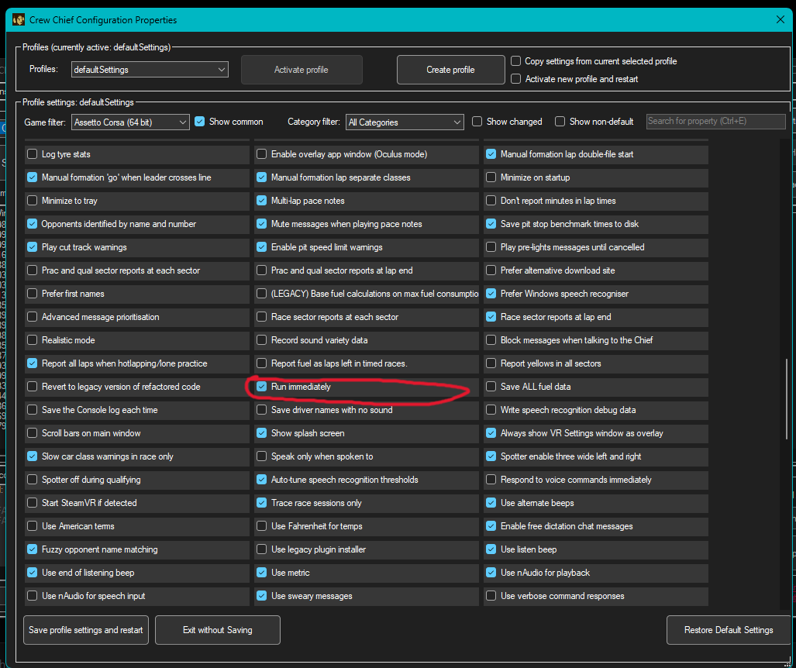
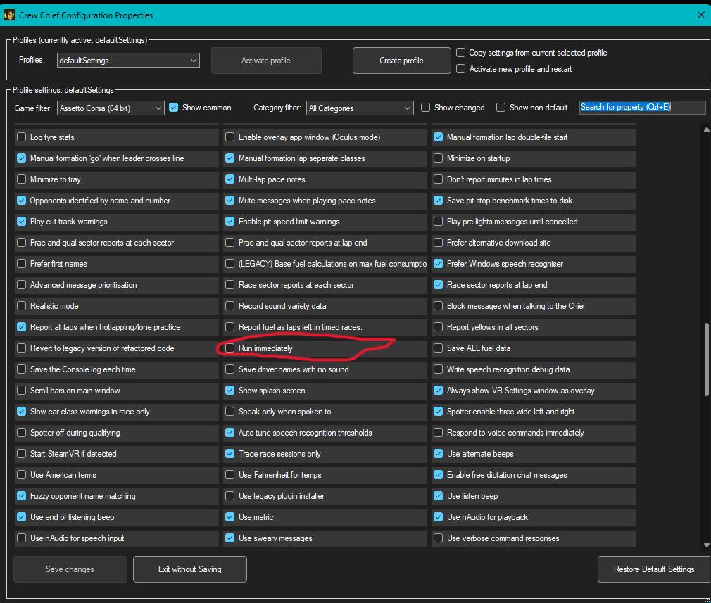

# CrewChief Auto-Launcher

Automatically launches [CrewChief](https://thecrewchief.org/) with the correct game selected as soon as you start a supported racing game - and closes it again when you're done. Runs silently in the background with a system tray icon showing its current status.

## Features

- Detects 20+ racing games automatically
- Selects the correct game in CrewChief and clicks "Start Crew Chief" for you
- Closes CrewChief when you exit the game (with a configurable grace period)
- Starts automatically with Windows - completely hidden, no console window
- System tray icon shows current status (grey = idle, orange = starting, green = active)
- Supports Content Manager for Assetto Corsa (does not restart CC when switching cars)

## Requirements

- Windows 10 or 11
- [CrewChief](https://thecrewchief.org/) installed at the default location:
  `C:\Program Files (x86)\Britton IT Ltd\CrewChiefV4\CrewChiefV4.exe`
- PowerShell 5.1 (included with Windows)

## Installation

1. Download and extract the ZIP to any folder (e.g. `Downloads`)
2. Double-click **`Install.bat`**
3. That's it - the launcher starts immediately and will auto-start on every Windows login

A grey **CC** icon will appear in your system tray to confirm it's running.

> **Security note:** The installer registers a PowerShell script to run at startup using
> `-ExecutionPolicy Bypass`. This is standard practice for unsigned scripts and only affects
> this specific script - it does not change your system-wide PowerShell policy.

## Required CrewChief setting

The launcher clicks "Start Crew Chief" for you automatically. For this to work correctly, CrewChief's built-in **"Run immediately"** option must be **disabled**.

If "Run immediately" is enabled, CrewChief will try to start itself at the same time as the launcher - causing a conflict where CrewChief stops immediately after starting.

**How to disable it:**
1. Open CrewChief
2. Click **Properties** (top-right)
3. Search for **"Run immediately"** using the search box (Ctrl+E), or scroll to find it
4. Make sure the checkbox is **unchecked**
5. Click **Save profile settings and restart**

| This causes issues | This is correct |
|---|---|
|  |  |

## Uninstallation

Double-click **`Uninstall.bat`** - this removes the startup entry and stops the running launcher.

## Tray icon

Right-click the **CC** icon in the system tray for options:

| Icon color | Meaning |
|------------|---------|
| Grey | Idle - waiting for a game to start |
| Orange | Launching CrewChief |
| Green | CrewChief is active and listening |

Menu options:
- **Open logbestand** - opens the log file in Notepad for troubleshooting
- **Launcher stoppen** - stops the launcher (does not uninstall)

## Supported games

| Game | Process detected |
|------|-----------------|
| iRacing | `iRacingSim64DX11`, `iRacingSim64` |
| Le Mans Ultimate | `Le Mans Ultimate`, `LMU`, `LeMansCentral` |
| Assetto Corsa Competizione | `AC2-Win64-Shipping` |
| Assetto Corsa (+ Content Manager) | `AssettoCorsa`, `Content Manager`|
| Automobilista 2 | `AMS2AVX`, `AMS2` |
| rFactor 2 | `rFactor2` |
| Project CARS 2 | `pCARS2` |
| Project CARS 3 | `pCARS3` |
| Project CARS (original) | `pCARS64`, `pCARS` |
| RaceRoom Racing Experience | `RRRE64`, `RRRE` |
| DiRT Rally | `dirtrally` |
| F1 2018-2024 | `F1_18` through `F1_24` |
| GTR2 | `GTR2` |
| Richard Burns Rally | `RichardBurnsRally_SSE` |
| rFactor / Automobilista 1 | `rFactor` |

## Adding a game yourself

Open `CrewChiefAutoLauncher.ps1` in Notepad (or any text editor) and find the `$GameMap` section near the top - it looks like this:

```powershell
$GameMap = [ordered]@{
    "iRacingSim64DX11" = "IRACING"
    "iRacingSim64"     = "IRACING"
    # ... more games ...
}
```

To add a game, you need two pieces of information:

### 1. The process name

This is the name of the game's `.exe` file **without** the `.exe` extension.

**How to find it:**
1. Start the game
2. Open Task Manager (`Ctrl+Shift+Esc`) → **Details** tab
3. Look for the game process - the name in the **Name** column without `.exe` is what you need

*Example: if you see `MyRacingGame.exe`, the process name is `MyRacingGame`*

### 2. The CrewChief GameEnum value

This tells CrewChief which game to select. The full list of supported values:

| Value | Game |
|-------|------|
| `IRACING` | iRacing |
| `LMU` | Le Mans Ultimate |
| `ACC` | Assetto Corsa Competizione |
| `ASSETTO_64BIT` | Assetto Corsa (64-bit) |
| `ASSETTO_32BIT` | Assetto Corsa (32-bit) |
| `ASSETTO_EVO` | Assetto Corsa EVO |
| `AMS2` | Automobilista 2 |
| `AMS` | Automobilista 1 |
| `RF2_64BIT` | rFactor 2 (64-bit) |
| `RF1` | rFactor 1 |
| `PCARS2` | Project CARS 2 |
| `PCARS3` | Project CARS 3 |
| `PCARS_64BIT` | Project CARS (64-bit) |
| `PCARS_32BIT` | Project CARS (32-bit) |
| `RACE_ROOM` | RaceRoom Racing Experience |
| `DIRT` | DiRT Rally |
| `F1_2023` | F1 2023 / F1 2024 |
| `F1_2022` | F1 2022 |
| `F1_2021` | F1 2021 |
| `F1_2020` | F1 2020 |
| `F1_2019` | F1 2019 |
| `F1_2018` | F1 2018 |
| `GTR2` | GTR2 |
| `RBR` | Richard Burns Rally |
| `GSC` | Game Stock Car |
| `FTRUCK` | Formula Truck |
| `MARCAS` | Stock Car Extreme / Marcas |

> If your game is not in CrewChief's supported list, the launcher can still detect and launch CC,
> but CC won't have telemetry for it.

### Putting it together

Add a new line inside the `$GameMap` block:

```powershell
$GameMap = [ordered]@{
    "iRacingSim64DX11" = "IRACING"
    # ... existing entries ...

    # My new game
    "MyRacingGame"     = "RACE_ROOM"
}
```

Save the file, then restart the launcher:
1. Right-click the **CC** tray icon → **Launcher stoppen**
2. Double-click `Install.bat` (or run the VBS in your Startup folder)

## Configuration

Open `CrewChiefAutoLauncher.ps1` and edit the values at the top of the file:

```powershell
$CrewChiefExe  = "C:\Program Files (x86)\Britton IT Ltd\CrewChiefV4\CrewChiefV4.exe"
$CheckInterval = 5000   # How often to check for games (milliseconds)
$GracePeriod   = 15     # Seconds to wait after game closes before stopping CC
```

## Troubleshooting

**Tray icon doesn't appear**
- Make sure no old launcher instance is running (check Task Manager for `powershell.exe`)
- Check the log file at `%LOCALAPPDATA%\CrewChiefAutoLauncher\launcher.log`

**Game is not detected**
- Verify the process name in Task Manager → Details tab
- Make sure the process name is spelled exactly right (case-sensitive) in `$GameMap`

**CrewChief stops immediately after being started by the launcher**
- Disable the **"Run immediately"** option in CrewChief's Properties (see [Required CrewChief setting](#️-required-crewchief-setting) above)

**CrewChief doesn't start listening automatically**
- Check the log for `[CLICK]` entries - this shows what `ClickStart.ps1` found
- If CC opens but the button isn't clicked, CC may be loading slowly - the script waits up to 70 seconds total

**CrewChief is installed in a different location**
- Update the `$CrewChiefExe` path at the top of `CrewChiefAutoLauncher.ps1`

## Log file

The log is at `%LOCALAPPDATA%\CrewChiefAutoLauncher\launcher.log` and can be opened via the tray icon menu. It is automatically trimmed to 1000 lines.

## License

MIT - free to use, modify, and share.
